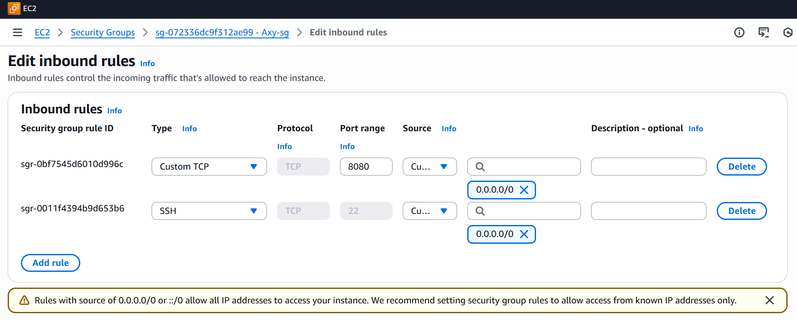
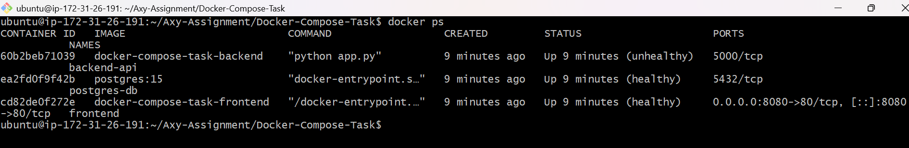
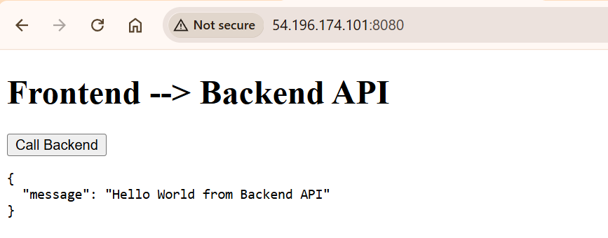
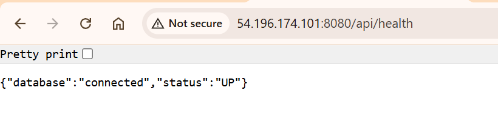

# Docker Compose Full-Stack Setup (EC2 Deployment)

This repository demonstrates a **production‑style Docker Compose architecture** with:

* **Frontend (Nginx + HTML/JS)** – exposed to the internet
* **Backend API (Python Flask)** – private service
* **PostgreSQL Database** – private, persistent storage

The setup is intentionally designed to reflect **real-world DevOps best practices**:

* Only the frontend is exposed
* Backend and database are isolated inside a private Docker network
* Environment variables and health checks are used

---

## Architecture Overview

```
Browser
   │
   ▼
EC2 Public IP :8080
   │
Frontend (Nginx)
   │
Backend API (Flask)
   │
PostgreSQL Database
```

---

## Prerequisites

* AWS account
* EC2 instance (Ubuntu 20.04 or later recommended)
* SSH key pair
* Basic knowledge of Linux & Docker

---

## Step 1: Create an EC2 Instance

* Launch an **Ubuntu EC2 instance**
* Instance type: `t2.micro` (sufficient for demo)
* Attach a Security Group (details below)

### Security Group (IMPORTANT)

Allow **only required ports**:

| Port | Purpose         | Source                              |
| ---- | --------------- | ----------------------------------- |
| 22   | SSH             | Your IP only                        |
| 8080 | Frontend access | Your IP / 0.0.0.0/0 (for demo only) |

❌ Do NOT open:

* 5000 (Backend)
* 5432 (Postgres)

📸 **Example Security Group configuration:**


---

## Step 2: SSH into the EC2 Instance

```bash
ssh -i <private-key.pem> ubuntu@<EC2_PUBLIC_IP>
```

---

## Step 3: Install Docker Engine

Follow **official Docker documentation** (recommended):

[https://docs.docker.com/engine/install/ubuntu/](https://docs.docker.com/engine/install/ubuntu/)

Quick verification:

```bash
docker --version
```

---

## Step 4: Verify Docker Compose Plugin

```bash
docker compose version
```

If not installed, install it via official Docker documentation.

---

## Step 5: Clone the Repository

```bash
git clone <repository-url>
cd Docker-Compose-Task
```

---

## Step 6: Environment Configuration

Ensure the `.env` file exists with required values:

```env
POSTGRES_USER=appuser
POSTGRES_PASSWORD=apppass
POSTGRES_DB=appdb

DB_HOST=db
DB_PORT=5432
```

⚠️ Do not commit sensitive credentials in real projects.

---

## Step 7: Run the Application

```bash
docker compose up --build
```

This will:

* Build frontend & backend images
* Start PostgreSQL with persistent volume
* Create a private Docker network

---

## Step 8: Verify Containers

```bash
docker ps
```

Expected output:

* `frontend` → **healthy**, port `8080` exposed
* `backend` → **running** (private)
* `postgres-db` → **healthy** (private)

📸 **Example output:**



---

## Step 9: Verify Application (End‑to‑End)

### 1️⃣ Frontend Access

```
http://<EC2_PUBLIC_IP>:8080
```

You should see:

* **Frontend → Backend API** page
* Button to call backend

### 2️⃣ Backend via Frontend (Reverse Proxy)

```
http://<EC2_PUBLIC_IP>:8080/api/message
```

Expected response:

```json
{
  "message": "Hello World from Backend API"
}
```

📸 **Example response:**



http://<EC2_PUBLIC_IP>:8080/api/message

````

Expected response:

```json
{
  "message": "Hello World from Backend API"
}
````

### 3️⃣ Health Check

```
http://<EC2_PUBLIC_IP>:8080/api/health
```

Expected response:

```json
{
  "database": "connected",
  "status": "UP"
}
```

📸 **Database connectivity check:**



http://<EC2_PUBLIC_IP>:8080/api/health

````

Expected response:

```json
{
  "database": "connected",
  "status": "UP"
}
````

---

## Important Technical Notes

### 🔹 Why only frontend is exposed

* Backend and database are reachable **only inside Docker network**
* Improves security and matches real production setups

### 🔹 Nginx DNS Resolution Fix

Nginx resolves upstream DNS at startup. Docker DNS is eventually consistent.

To avoid startup crashes, Nginx is configured with:

```nginx
resolver 127.0.0.11 valid=10s;
```

This ensures runtime DNS resolution inside Docker.

---

## Common Issues & Fixes

| Issue             | Cause                 | Fix                     |
| ----------------- | --------------------- | ----------------------- |
| Frontend exits    | Nginx DNS failure     | Use Docker DNS resolver |
| Backend unhealthy | Healthcheck misconfig | Use Python-based check  |
| 404 on /api       | No reverse proxy      | Configure Nginx         |
| Cannot access app | SG rules              | Open port 8080          |

---

## Cleanup

```bash
docker compose down --volumes
```

---

## Final Notes

This project is designed to demonstrate:

* Docker Compose networking
* Service isolation
* Reverse proxy setup
* Health checks
* Production‑grade debugging scenarios

✅ Suitable for DevOps interviews
✅ Reflects real‑world containerized architecture

---

**Author**: Suyash
